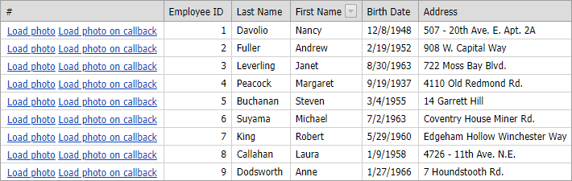

<!-- default badges list -->

[](https://supportcenter.devexpress.com/ticket/details/E2577)
[](https://docs.devexpress.com/GeneralInformation/403183)
<!-- default badges end -->

# Grid View for ASP.NET Web Forms - How to load a file from the client side
<!-- run online -->
**[[Run Online]](https://codecentral.devexpress.com/e2577/)**
<!-- run online end -->

This example shows how to load a file when a user clicks a custom command button in Grid. 



When a user clicks a button, the corresponding file name, which equals Employee ID, is added to the `window.location.href` property as a parameter. On the server side, the file with the specified name is send to the client in response.

```cs
protected void Page_Load(object sender, EventArgs e) {
    if (Request["ID"] != null)
        SendFile(Request["ID"]);
// ...
```

This example demonstrates how to specify the uploaded file name in two ways:

* Specify the name completely on the client side.
* Send a callback to get the name from the server side.

For demonstration purposes, in both approaches it is prohibited to download the **9.png** file.

## Specify the file name completely on the client side.

Handle the [CustomButtonClick](https://docs.devexpress.com/AspNet/js-ASPxClientGridView.CustomButtonClick) event to set the `window.location.href` property.

```js
function DoClientRedirect(value) {
    window.location.href = 'Default.aspx?ID=' + value;
}
```

## Send a callback to get the file name from the server side.

Add the [ASPxCallback](https://docs.devexpress.com/AspNet/DevExpress.Web.ASPxCallback) control to your application and call the [PerformCallback](https://docs.devexpress.com/AspNet/js-ASPxClientCallback.PerformCallback(parameter)) method to sends a callback to the server.

```js
function DoCallbackRedirect(value) {
    callback.PerformCallback(value);
}
```
The method invokes the server [Callback](https://docs.devexpress.com/AspNet/DevExpress.Web.ASPxCallback.Callback) event. Handle the event to specify the 
name of the downloaded file and send the result to the client [CallbackComplete](https://docs.devexpress.com/AspNet/js-ASPxClientCallback.CallbackComplete) event.

```cs
protected void ASPxCallback1_Callback(object source, CallbackEventArgs e) {
    e.Result = string.Format("Default.aspx?ID={0}", e.Parameter);
}
```
Handle the `CallbackComplete` event to set the `window.location.href` property.

```js
function OnCallbackComplete(s, e) {
    window.location.href = e.result;
}
```

## Files to Review

* [Default.aspx](./CS/Default.aspx) (VB: [Default.aspx](./VB/Default.aspx))
* [Default.aspx.cs](./CS/Default.aspx.cs) (VB: [Default.aspx.vb](./VB/Default.aspx.vb))

## Documentation 

* [Callbacks](https://docs.devexpress.com/AspNet/402559/common-concepts/callbacks)

## More Examples → [Add links to the related examples]

* [ASPxTreeList - How to download a file by clicking a custom command button](https://github.com/DevExpress-Examples/aspxtreelist-how-to-download-a-file-by-clicking-a-custom-command-button-e3919)
